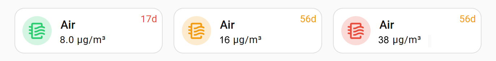
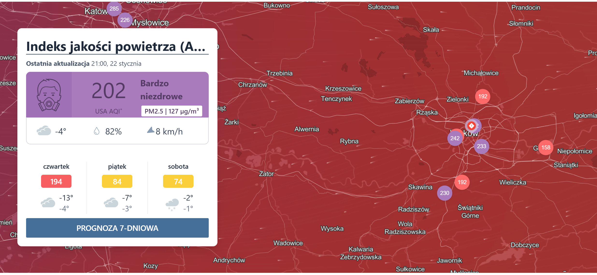

[Версия на русском](README_ru.md)

# 🌫️ Xiaomi Air Purifier in Home Assistant (LAN)

I connected my **Xiaomi Purifier 4 Compact** to **Home Assistant** via LAN.  
Functionally everything worked, but the organization of stock dashboard cards didn’t suit me. In the end, I made a custom card — predictable, compact, and informative.


- the icon color changes depending on the pollution level 🟢🟠🔴
- shows the current PM2.5 level
- when the filter is running out, the remaining filter life in days is displayed  
  - less than 60 days — orange 🟧  
  - less than 30 days — red 🟥
- tapping the card lets you control the purifier fan speed
- tapping the icon shows the air quality graph — convenient for correlating air quality changes with your actions

**Yes, this is not rocket science.  
But if it saves someone a couple of hours of life — then it was worth it.**

🐲 By the way, for Kraków the topic of air purifiers is especially relevant: at the time of writing, it made it into the top 4 most polluted cities in the world (momentarily). This is a short-term winter phenomenon, but still an unpleasant fact.


## 🛠 Installation and setup
> I didn’t turn this code into a package because, in my opinion, Lovelace package distribution in Home Assistant is not better than simple manual copying. So the text you’re reading is an article, not an installation manual. Don’t worry though — everything is very simple. If you don’t have a Xiaomi device, skip the Xiaomi-related parts.

### 1. Install required modules
All modules are installed via [HACS](#what-is-hacs). [Install HACS first](#what-is-hacs) if you don’t have it yet. This is basically a foundation for Home Assistant and you’ll almost certainly need it many more times.
Below are the modules you need to install by finding them one by one in the HACS search bar, selecting each, and clicking the download button:
- ```Xiaomi Miot``` — for local connection of Xiaomi devices;
- ```card-mod``` — to enable styling of stock cards;
- ```Decluttering card``` — a templating tool to avoid duplicating the entire card code when using multiple devices.

### 2. Connect Xiaomi devices via LAN
> Please skip this step if you have already configured your device via LAN. If not — it’s worth reading.

#### Why connecting via LAN instead of the Xiaomi cloud is useful 🤔
1. You don’t depend on a Chinese server — your device is controlled within ~10 meters, not halfway around the world;
2. You don’t depend on internet outages or issues with your ISP;
3. Device response speed on the local network is significantly higher than via the internet;
4. You truly control your device.

#### How to configure the connection
1. Add the Xiaomi Miot integration: https://my.home-assistant.io/redirect/config_flow_start?domain=xiaomi_miot
2. I recommend logging in with your MI account to gain local access to all devices in your account and selecting the Local connection type.

### 3. Adding cards
On the dashboard you want, click the top-right ⋮ → Edit dashboard → ⋮ → Raw configuration editor

> ⚠️ This option will not be available if the dashboard was created in UI mode. In that case, do the following:  
> Settings → Dashboards → select the dashboard → Take control / Switch to YAML mode

#### 3.1. Adding the template
Add the following code (recommended at the very bottom):

```yaml
decluttering_templates:
  xiaomi_air_cleaner_tile:
    default:
      name: Air      
    card:
      type: tile
      entity: '[[entity_pm25]]'
      name: '[[name]]'
      icon: mdi:air-filter
      vertical: false
      features_position: bottom
      tap_action:
        action: more-info
        entity: '[[entity_fan]]'
      icon_tap_action:
        action: more-info
      card_mod:
        style: |
          ha-card {
            position: relative;            
            
            
              --badge-text: "{{ d|round(0) }}d";
              --badge-color: #e74c3c;
            
              --badge-text: "{{ d|round(0) }}d";
              --badge-color: #f39c12;
            
              --badge-text: "";
            

            
            
              --tile-color: #9e9e9e !important;
            
              
              
                --tile-color: #2ecc71 !important;
              
                --tile-color: #f39c12 !important;
              
                --tile-color: #e74c3c !important;
              
            
          }

          ha-card::after {
            content: var(--badge-text);
            position: absolute;
            top: 3px;
            right: 6px;
            font-size: 12px;
            font-weight: 400;
            color: var(--badge-color);
            pointer-events: none;
          }
```

#### 3.2 Adding a card
There are two options: you can edit the card in the same Raw Configuration Editor, or directly on the dashboard by switching to YAML (code) mode:

```yaml
- type: custom:decluttering-card
  template: xiaomi_air_cleaner_tile
  variables:
    - name: Air
    - entity_pm25: sensor.xiaomi_cpa4_9c14_pm25_density
    - entity_filter: sensor.xiaomi_cpa4_9c14_filter_left_time
    - entity_fan: fan.xiaomi_cpa4_9c14_air_purifier
```

- name — optional; if omitted, the card will be named “Air”
- the remaining fields are mandatory; you must specify the corresponding sensors of your device for each card. You can create as many such cards as you like.

<a id="what-is-hacs"></a>
## 🛍 Appendix 1 — What is HACS?

HACS (Home Assistant Community Store) is a community-driven extension system for Home Assistant.
It allows you to install third-party blueprints, integrations, dashboards, and custom components directly from GitHub — with update notifications and version management.

### How to install HACS

> During the first-time setup, HACS will ask you to sign in to GitHub and authorize access.  
> You need a GitHub account for this (create one if needed: [https://github.com/signup](https://github.com/signup)).  
> 🧘‍♂️ The authorization is read-only — HACS can only download public repositories and cannot modify your GitHub account or data.  

👉 [Follow the official HACS setup instruction](https://hacs.xyz/docs/use/#getting-started-with-hacs)
