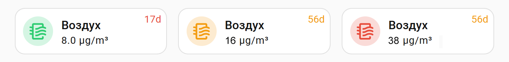

[Switch to English version](readme.md)

# 🌫️ Xiaomi Air Purifier в Home Assistant (LAN)

Я подключил свои **Xiaomi Purifier 4 Compact** к **Home Assistant** по LAN.  
Функционально всё работало, но организация стоковых карточек на дашборде меня не устроила. В итоге я сделал кастомную карточку — предсказуемую, компактную и информативную.


- иконка меняет цвет в зависимости от уровня загрязнения 🟢🟠🔴
- отображается текущий уровень PM2.5
- когда фильтр заканчивается, отображается ресурс фильтра в днях 
  -  менее 60 дней — оранжевый 🟧
  -  менее 30 дней — красный 🟥
- по клику на карточку можно регулировать скорость работы очистителя
- по клику на иконку отображается график чистоты воздуха — удобно сопоставлять изменения качества воздуха со своими действиями

**Да, это не ракетостроение.  
Но если кому-то это сэкономит пару часов жизни — значит, всё было не зря.**

🐲 Кстати, для Кракова тема очистителей особенно актуальна: на момент написания он попал в топ-4 самых загрязнённых городов мира (в моменте). Это кратковременное зимнее явление — в среднем всё не так плохо, но ощущается неприятно.


## Установка и настройка 🛠
Я не стал делать из этого кода пакет по той причине, что на мой взгляд в HA, в том числе HACS дистрибуция Lovelace пакетов построена не лучше чем просто копирование вручную, поэтому текст, который вы читаете - статья а не описание инсталляции. Но тем не менее настройка очень проста.

### Установите зависимости

1. Для того чтобы использовать свои CSS стилизации в стоковых карточках исползуется модуль ```card-mod```, распространяемый через HACS.
   - Установите вначале HACS если его у вас нет.
   - После этого установите ```сard-mod```, найдя его в поиске HACS и нажав Download.
2. Чтобы не писать кучу кода для каждой новой карточки для очистителя в очередной комнате требуется установить через HACS шаблонизатор карточек: ```Decluttering card```.


## 🛍 Appendix 1 — What is HACS?

HACS (Home Assistant Community Store) is a community-driven extension system for Home Assistant.
It allows you to install third-party blueprints, integrations, dashboards, and custom components directly from GitHub — with update notifications and version management.

### How to install HACS

> During the first-time setup, HACS will ask you to sign in to GitHub and authorize access.  
> You need a GitHub account for this (create one if needed: [https://github.com/signup](https://github.com/signup)).  
> 🧘‍♂️ The authorization is read-only — HACS can only download public repositories and cannot modify your GitHub account or data.  

👉 [Follow the official HACS setup instruction](https://hacs.xyz/docs/use/#getting-started-with-hacs)
